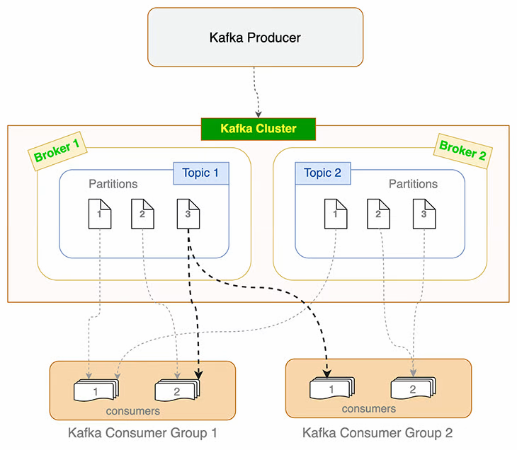

# kafka-nodejs


*Overview*


## Start

### Start Kakfa Broker and Zookeeper inside docker

```
docker-compose up -d
```

## Setup consumers

Run consumer by passing the arg to control the group id.  
To add one or more consumers in consumer group `id`, run the following command in different terminals:

```
node consumer.js <id>
```

You can try by executing one or more consumers in the different consumer groups and see how they each consume messages.

1. Execute the producer with desired number of messages
Running `node producer.js <number>` wills start send an event to kafka with desired number of messages


## Achieving Pub Sub Setup

### Usecase

When an order is created, we want to run the following actions:
- Update the available stock in inventory service
- Send order confirmation email
- Notify the procurement service
- Call third party delivery service API

Although it is possible to have a single consumer run all these business logic but in microservice architecture these business logics will be residing in different services, and hence the different consumers.  
Also it's better if these actions should happen parallely, even if not in different services.

### Solution
For each action, we create a consumer.

| Consumer | Consumer Group 
|-|-
| InventoryUpdate | order.create-consumerGroup-inventoryUpdate 
| SendConfirmation | order.create-consumerGroup-sendConfirmation 
| NotifyProcurment | order.create-consumerGroup-notifyProcurement
| HandleDelivery | order.create-consumerGroup-handleDelivery  

Above consumers being in different consumer groups, they all will be notified parallely by kafka. This way our Pub-Sub setup is complete

